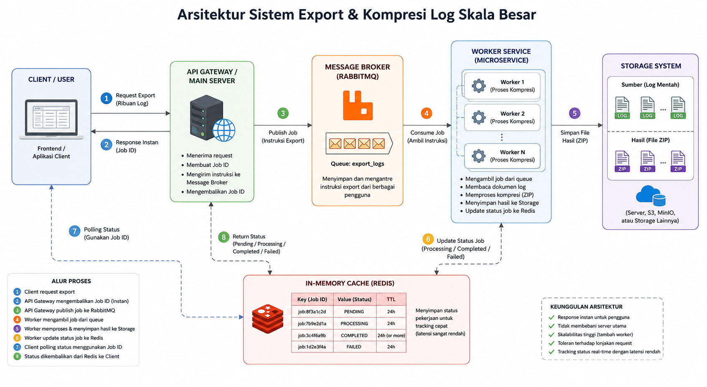
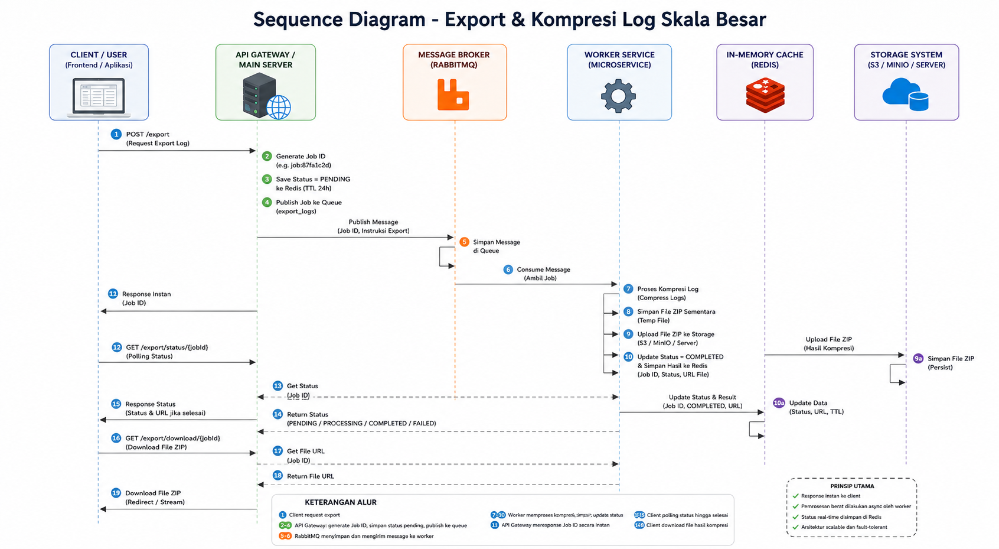
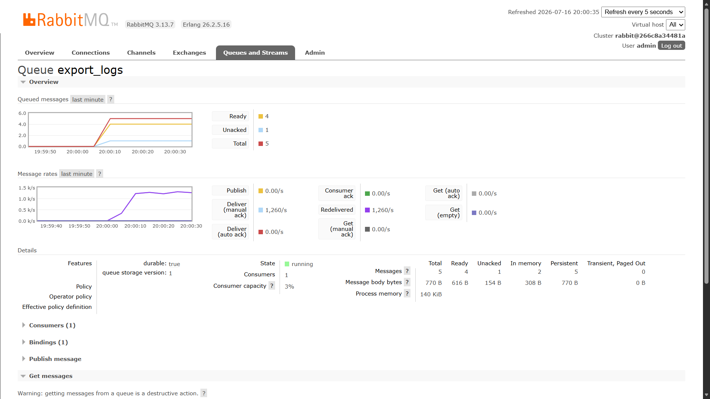
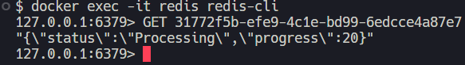
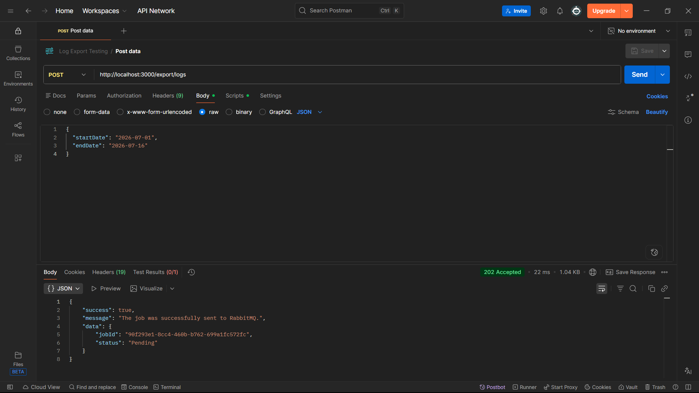
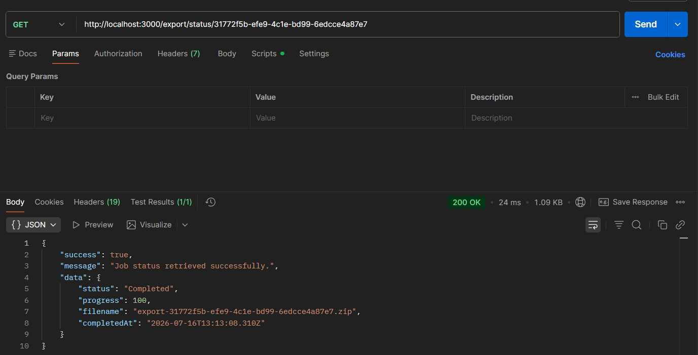

<div align="center">

# 🚀 Asynchronous Log Export System

**A scalable asynchronous log export system built with Node.js, RabbitMQ, Redis, and Docker.**

The system is designed to handle thousands of log files efficiently by offloading heavy compression tasks to background workers using a message queue architecture.


</div>

---

# 📖 Project Overview

Traditional log export systems usually process file compression directly inside the main application server. This approach increases response time significantly and limits scalability when handling thousands of files simultaneously.

This project adopts an **asynchronous architecture** by separating responsibilities into several independent services:

- **API Gateway** handles incoming requests.
- **RabbitMQ** queues export jobs.
- **Worker Service** processes compression tasks.
- **Redis** stores real-time job status.
- **Storage** stores raw logs and generated ZIP files.

The API returns a **Job ID immediately**, allowing users to monitor progress without waiting for the compression process to finish.

---

# ✨ Features

- ✅ Asynchronous Background Processing
- ✅ RabbitMQ Message Queue
- ✅ Redis Job Status Tracking
- ✅ API Gateway Pattern
- ✅ Worker Microservice
- ✅ ZIP Compression
- ✅ Dockerized Environment
- ✅ RESTful API
- ✅ Load & Performance Tested
- ✅ Scalable Architecture

---

# 🛠 Tech Stack

| Technology | Purpose             |
| ---------- | ------------------- |
| Node.js    | Backend Runtime     |
| Express.js | REST API            |
| RabbitMQ   | Message Broker      |
| Redis      | Job Status Cache    |
| Docker     | Containerization    |
| Archiver   | ZIP Compression     |
| UUID       | Job ID Generator    |
| JMeter     | Performance Testing |
| Postman    | API Testing         |

---

# 🏗 System Architecture

<p align="center">

</p>

### Architecture Components

### API Gateway

- Receive client request
- Validate request
- Generate Job ID
- Store initial status in Redis
- Publish job to RabbitMQ
- Return response immediately

### RabbitMQ

Acts as a queue between the API Gateway and Worker Service.

### Worker Service

- Listen to RabbitMQ
- Read thousands of log files
- Compress into ZIP
- Store ZIP file
- Update Redis status

### Redis

Stores job status:

- Pending
- Processing
- Completed
- Failed

---

# 🔄 Sequence Diagram

<p align="center">

</p>

---

# 📁 Folder Structure

```text
asynclog
│
├── api/
│   ├── src/
│   │   ├── controllers/
│   │   ├── middleware/
│   │   ├── rabbitmq/
│   │   ├── redis/
│   │   ├── routes/
│   │   ├── utils/
│   │   └── app.js
│   └── package.json
│
├── worker/
│   ├── src/
│   │   ├── services/
│   │   ├── rabbitmq.js
│   │   ├── redis.js
│   │   └── worker.js
│   └── package.json
│
├── storage/
│   ├── raw_logs/
│   └── exports/
│
├── scripts/
│
├── docs/
│
├── docker-compose.yml
└── README.md
```

---

# ⚙ Installation

Clone repository

```bash
git clone https://github.com/luqelha/asynchronous-log-system.git

cd asynchronous-log-system
```

---

Install dependencies

API

```bash
cd api

npm install
```

Worker

```bash
cd worker

npm install
```

---

# 🐳 Docker Setup

Run all services

```bash
docker compose up -d
```

Verify running containers

```bash
docker ps
```

Expected Services

- RabbitMQ
- Redis

---

RabbitMQ Dashboard

```
http://localhost:15672
```

Username

```
admin
```

Password

```
admin
```

---

Redis CLI

```bash
docker exec -it redis redis-cli
```

---

# 🚀 Running the Project

API Gateway

```bash
cd api

npm run dev
```

Worker

```bash
cd worker

npm run dev
```

---

# 📡 API Endpoints

## Export Logs

```
POST /export/logs
```

Example Request

```json
{
  "startDate": "2025-01-01",
  "endDate": "2025-01-31"
}
```

Example Response

```json
{
  "success": true,
  "jobId": "xxxxxxxx",
  "status": "Pending"
}
```

---

## Check Status

```
GET /status/:jobId
```

Example Response

```json
{
  "status": "Completed",
  "progress": 100,
  "filename": "export.zip"
}
```

---

# 👷 Worker Flow

```text
Receive Job
      │
      ▼
Update Redis (Processing)
      │
      ▼
Read Raw Logs
      │
      ▼
Compress Files
      │
      ▼
Store ZIP
      │
      ▼
Update Redis (Completed)
      │
      ▼
ACK RabbitMQ
```

---

# 🐇 RabbitMQ Flow

<p align="center">

</p>

The API Gateway publishes export jobs into the `export_logs` queue. Worker Service continuously consumes messages from the queue and processes them asynchronously.

---

# 📦 Redis Flow

<p align="center">

</p>

Redis stores each Job ID as a key, allowing clients to retrieve job progress efficiently without querying a relational database.

---

# 📈 Performance Testing

Performance testing was conducted using **Apache JMeter** with multiple concurrent user scenarios.

| Scenario           | Requests | Avg Response (ms) | Max Response (ms) | Throughput (req/s) | Error Rate | Result  |
| ------------------ | -------: | ----------------: | ----------------: | -----------------: | ---------: | ------- |
| Test 1 (10 Users)  |       10 |                19 |                83 |               2.22 |      0.00% | ✅ Pass |
| Test 2 (25 Users)  |       25 |                 6 |                 9 |               5.20 |      0.00% | ✅ Pass |
| Test 3 (50 Users)  |       50 |                16 |               131 |              10.32 |      0.00% | ✅ Pass |
| Test 4 (100 Users) |      100 |                 9 |                89 |              20.18 |      0.00% | ✅ Pass |
| Test 5 (200 Users) |      200 |                 9 |                85 |              40.13 |      0.00% | ✅ Pass |

### Summary

- Response time remained well below **1 second**.
- Error rate remained **0%** across all test scenarios.
- Throughput increased proportionally with the number of concurrent requests.
- API Gateway remained responsive because compression tasks were delegated to Worker Service via RabbitMQ.

---

# 📷 Screenshots

## Architecture


---

## Sequence Diagram


---

## RabbitMQ Dashboard


---

## Redis CLI


---

## POST Endpoint



---

## GET Status Endpoint



---

## System Demo


---

# 🔮 Future Improvements

- JWT Authentication
- Download endpoint for ZIP files
- Multiple Worker instances
- Kubernetes deployment
- Prometheus & Grafana monitoring
- CI/CD pipeline using GitHub Actions
- Object Storage integration (MinIO / AWS S3)
- WebSocket for real-time status updates
- Retry & Dead Letter Queue (DLQ)

---

# 👨‍💻 Author

**Muhammad Luqmanul Hakim**

GitHub: https://github.com/luqelha

LinkedIn: https://linkedin.com/in/muhammad-luqmanul-hakim-77047326a

---

<div align="center">

⭐ If you find this project useful, consider giving it a star!

</div>
