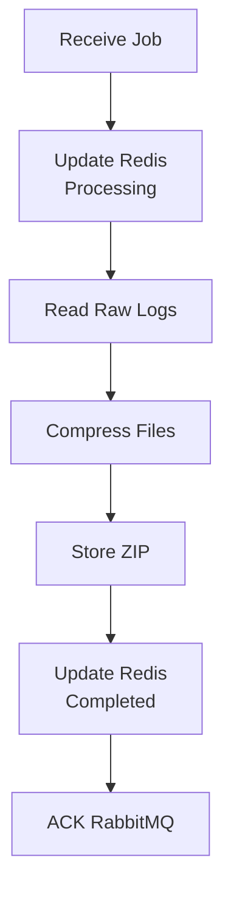

<div align="center">

# 🚀 Asynchronous Log Export System

**A scalable asynchronous log export system built with Node.js, RabbitMQ, Redis, and Docker.**

The system efficiently exports and compresses thousands of log files by delegating heavy tasks to asynchronous background workers powered by RabbitMQ.


</div>

---

## 📖 Project Overview

Traditional log export systems usually perform compression directly inside the application server, causing long response times and poor scalability.

This project adopts an **asynchronous architecture**, where the API Gateway immediately returns a **Job ID** while the actual compression process runs in the background through RabbitMQ and Worker Services.

> [!NOTE]
> The client never waits for the compression process. Once a request is submitted, the API immediately returns a Job ID that can be used to monitor export progress.

## 📚 Table of Contents

- [Features](#-features)
- [System Architecture](#-system-architecture)
- [Tech Stack](#-tech-stack)
- [Folder Structure](#-folder-structure)
- [Installation](#-installation)
- [Docker Setup](#-docker-setup)
- [Running the Project](#-running-the-project)
- [API Documentation](#-api-documentation)
- [Performance Testing](#-performance-testing)
- [Screenshots](#-screenshots)
- [Roadmap](#-roadmap)
- [Author](#-author)

## Features

- ✅ API Gateway Architecture
- ✅ RabbitMQ Message Queue
- ✅ Worker Microservice
- ✅ Redis Job Status Tracking
- ✅ ZIP Compression
- ✅ Background Processing
- ✅ Dockerized Deployment
- ✅ RESTful API
- ✅ Load Tested with Apache JMeter

## 🏗 System Architecture

<p align="center">

</p>

### Architecture Components

| Component      | Responsibility                                                  |
| -------------- | --------------------------------------------------------------- |
| API Gateway    | Receive requests, validate input, generate Job ID, publish jobs |
| RabbitMQ       | Queue export jobs                                               |
| Worker Service | Consume jobs, compress logs, update Redis                       |
| Redis          | Store real-time job status                                      |
| Storage        | Store raw logs and ZIP results                                  |

### Sequence Diagram

<p align="center">

</p>

### Worker Processing Flow



> [!TIP]
> Multiple Worker instances can consume the same RabbitMQ queue, allowing the system to scale horizontally without changing the API Gateway.

## 🛠 Tech Stack

| Technology    | Purpose             |
| ------------- | ------------------- |
| Node.js       | Backend Runtime     |
| Express.js    | REST API            |
| RabbitMQ      | Message Broker      |
| Redis         | Job Status Cache    |
| Docker        | Containerization    |
| Archiver      | ZIP Compression     |
| UUID          | Job ID Generator    |
| Apache JMeter | Performance Testing |
| Postman       | API Testing         |

## 📁 Folder Structure

```text
asynclog/
├── api/
├── worker/
├── storage/
├── scripts/
├── docs/
├── docker-compose.yml
└── README.md
```

## ⚙ Installation

Clone the repository.

```bash
git clone https://github.com/luqelha/asynchronous-log-system.git

cd asynchronous-log-system
```

Install dependencies.

```bash
cd api && npm install

cd ../worker && npm install
```

## 🐳 Docker Setup

Start infrastructure services.

```bash
docker compose up -d
```

RabbitMQ Dashboard

```
http://localhost:15672
```

Default Credentials

```
Username : admin
Password : admin
```

Redis CLI

```bash
docker exec -it redis redis-cli
```

## Running the Project

API Gateway

```bash
cd api

npm run dev
```

Worker

```bash
cd worker

npm run dev
```

## 📡 API Documentation

| Method | Endpoint         | Description         |
| ------ | ---------------- | ------------------- |
| POST   | `/export/logs`   | Create export job   |
| GET    | `/status/:jobId` | Retrieve job status |

### POST /export/logs

Request

```json
{
  "startDate": "2025-01-01",
  "endDate": "2025-01-31"
}
```

Response

```json
{
  "success": true,
  "jobId": "xxxxxxxx",
  "status": "Pending"
}
```

### GET /status/:jobId

```json
{
  "status": "Completed",
  "progress": 100,
  "filename": "export.zip"
}
```

## 📈 Performance Testing

Performance testing was conducted using **Apache JMeter** under multiple concurrent request scenarios.

| Scenario  | Requests | Avg (ms) | Max (ms) | Throughput (req/s) | Error |
| --------- | -------: | -------: | -------: | -----------------: | ----: |
| 10 Users  |       10 |       19 |       83 |               2.22 |    0% |
| 25 Users  |       25 |        6 |        9 |               5.20 |    0% |
| 50 Users  |       50 |       16 |      131 |              10.32 |    0% |
| 100 Users |      100 |        9 |       89 |              20.18 |    0% |
| 200 Users |      200 |        9 |       85 |              40.13 |    0% |

> [!NOTE]
> The API Gateway consistently returned responses in well under one second across all test scenarios because compression tasks were delegated to asynchronous Worker Services via RabbitMQ.

## 📷 Screenshots

### System Architecture


### Sequence Diagram


### RabbitMQ Dashboard


### Redis CLI


### POST Endpoint


### GET Status Endpoint


### System Demo


## 📌 Roadmap

- [ ] JWT Authentication
- [ ] Download ZIP Endpoint
- [ ] Multiple Worker Instances
- [ ] Dead Letter Queue (DLQ)
- [ ] Kubernetes Deployment
- [ ] Prometheus & Grafana Monitoring
- [ ] GitHub Actions CI/CD
- [ ] AWS S3 / MinIO Integration
- [ ] WebSocket-based Real-Time Status

---

## 👨‍💻 Author

**Muhammad Luqmanul Hakim**

- GitHub: https://github.com/luqelha
- LinkedIn: https://linkedin.com/in/muhammad-luqmanul-hakim-77047326a

<div align="center">

⭐ If you find this project useful, consider giving it a star!

</div>
